<div align="center">



<br/>

<a href="https://shoaib3-dportfolio.netlify.app" target="_blank">
  
</a>
<a href="https://www.linkedin.com/in/mohammed-shoaib-dev" target="_blank">
  
</a>
<a href="https://x.com/MdShoaib619538" target="_blank">
  
</a>
<a href="https://www.threads.net/@e_shoaib_7" target="_blank">
  
</a>

<br/><br/>


</div>

<br/>

<div align="center">

## 👨‍💻 About Me

</div>

```typescript
const shoaibMohammed = {
  location: "Currently 🇮🇳 India, Looking for opportunities in the UK and Europe",
  education: "MSc. Computer Science, Newcastle University, UK",
  role: "Frontend Engineer & Full-Stack Developer",
  
  expertise: {
    frontend: ["React", "Next.js 15", "TypeScript", "Tailwind CSS"],
    backend: ["Node.js", "Express", "PostgreSQL", "MongoDB"],
    ai: ["OpenAI GPT", "Google Gemini", "AI Integration"],
    deployment: ["Vercel", "Render", "AWS"],
  },
  
  achievements: [
    "🥈 2nd Place - CuraLink Hackathon (Healthcare AI Platform)",
    "🚀 3 Production SaaS Applications Deployed",
    "📊 544+ GitHub Contributions (Last Year)",
  ],
  
  currentFocus: [
    "🎨 Design Systems & Component Libraries",
    "⚡ Performance Optimization & Web Vitals",
    "♿ Accessibility (WCAG Compliance)",
    "🤖 AI-Powered Features & Automation",
  ],
  
  availability: "Open for exciting opportunities! 💼"
};
```

<br/>

<div align="center">

## 🛠️ Technology Arsenal

### Frontend Mastery


### Backend & Database


### Tools & Platforms


### Currently Exploring


</div>

<br/>

---

<br/>

<div align="center">

## 🚀 Featured Projects

*Full-stack applications showcasing modern architecture, AI integration, and production-grade code*

</div>

<br/>

<table align="center" width="100%">
<tr>
<td width="50%" valign="top">

<div align="center">

### 🏆 CuraLink
**🥈 2nd Place Hackathon Winner**


</div>

AI-powered healthcare platform bridging the gap between **patients** and **researchers**. Features intelligent clinical trial matching, health expert discovery, real-time chat, and community forums powered by **Google Gemini AI**.

**🔧 Tech Stack:**
- Next.js 16 + TypeScript
- PostgreSQL + Prisma
- Google Gemini AI
- JWT Authentication
- Real-time WebSockets

**✨ Key Features:**
- 🤖 AI-powered trial matching
- 💬 Real-time chat system
- 🔍 Smart expert discovery
- 📊 Integrated with PubMed & ClinicalTrials.gov
- 🌍 Global researcher network

<div align="center">

[](https://cura-link-hackathon-shoaib-mohammed.vercel.app/)

</div>

</td>
<td width="50%" valign="top">

<div align="center">

### 📧 SendStream
**Full-Stack SaaS Platform**


</div>

Enterprise-grade newsletter automation platform with **AI-powered content generation**. Built for scalability with complete subscriber management, analytics dashboard, and payment integration.

**🔧 Tech Stack:**
- Next.js 15 + TypeScript
- Node.js + Express
- MongoDB + Mongoose
- OpenAI GPT-3.5-turbo
- Stripe + SendGrid

**✨ Key Features:**
- 🤖 AI content generation (GPT-3.5)
- 📊 Real-time analytics dashboard
- 💳 Stripe subscription billing
- 📨 SendGrid email delivery
- 🔄 Mailchimp integration
- 📈 Growth tracking & insights

<div align="center">

[](https://send-stream.vercel.app/)

</div>

</td>
</tr>

<tr>
<td width="50%" valign="top">

<div align="center">

### 📊 RankForge
**AI-Powered SEO Platform**


</div>

Comprehensive SEO analysis platform with **keyword tracking**, competitor monitoring, and **AI-generated insights**. Export capabilities in PDF, CSV, and Excel formats with admin dashboard for usage monitoring.

**🔧 Tech Stack:**
- React + TypeScript
- Node.js + Express
- MongoDB
- Google Gemini AI
- Tailwind CSS

**✨ Key Features:**
- 🔍 Complete SEO analysis
- 📈 Keyword rank tracking
- 🤖 AI-powered insights (Gemini)
- 📄 Multi-format reports (PDF/CSV/Excel)
- 🎯 Competitor analysis
- 📊 Admin usage dashboard

<div align="center">

[](https://seo-rankforge.vercel.app/)

</div>

</td>
<td width="50%" valign="top">

<div align="center">

### 🔢 Sort Your Life
**Algorithm Visualizer**


</div>

Interactive web application for visualizing sorting algorithms with **step-by-step animations**. Educational tool helping students and developers understand algorithm complexity and behavior.

**🔧 Tech Stack:**
- Vanilla JavaScript
- HTML5 Canvas
- CSS3 Animations
- Responsive Design

**✨ Key Features:**
- 🎨 Multiple sorting algorithms
- ⚡ Real-time visualization
- 📊 Complexity analysis
- 🎯 Step-by-step breakdown
- 🎮 Interactive controls
- 📱 Mobile responsive

</td>
</tr>
</table>

<br/>

---

<br/>

<div align="center">

## 📈 GitHub Performance Metrics


<br/><br/>


<br/><br/>


</div>

<br/>

---

<br/>

<div align="center">

## 🏆 Achievements & Milestones

</div>

<table align="center">
<tr>
<td align="center" width="33%">


<br/><br/>

**CuraLink Healthcare Platform**

AI-powered clinical trial & expert discovery platform connecting patients with researchers worldwide.

<br/>

<a href="https://cura-link-hackathon-shoaib-mohammed.vercel.app/">
  
</a>

</td>
<td align="center" width="33%">


<br/><br/>

**Consistent Builder**

Daily commits, continuous learning, and open-source contributions demonstrating dedication to craft.

<br/>


</td>
<td align="center" width="33%">


<br/><br/>

**Full-Stack SaaS**

Live production applications serving real users with AI integration, payment processing, and analytics.

<br/>


</td>
</tr>
</table>

<br/>

---

<br/>

<div align="center">

## 💼 Professional Strengths

</div>

<table align="center">
<tr>
<td width="50%" valign="top">

### 🎨 Frontend Excellence
- **Modern Frameworks:** React 19, Next.js 15 (App Router)
- **Type Safety:** TypeScript with strict mode
- **Styling:** Tailwind CSS, Framer Motion animations
- **State Management:** Context API, React Query
- **Performance:** Code splitting, lazy loading, SSR/SSG
- **Testing:** Jest, React Testing Library

</td>
<td width="50%" valign="top">

### ⚙️ Backend Proficiency
- **Runtime:** Node.js with Express.js
- **Databases:** PostgreSQL, MongoDB with Prisma/Mongoose
- **APIs:** RESTful design, error handling, validation
- **Authentication:** JWT, bcrypt, session management
- **Security:** CORS, Helmet.js, rate limiting
- **DevOps:** CI/CD, containerization basics

</td>
</tr>
<tr>
<td width="50%" valign="top">

### 🤖 AI Integration
- **OpenAI:** GPT-3.5-turbo content generation
- **Google Gemini:** Intelligent recommendations
- **Use Cases:** Content creation, summarization, analysis
- **Optimization:** Token management, cost efficiency
- **Implementation:** Streaming, error handling, retries

</td>
<td width="50%" valign="top">

### 🚀 Deployment & Tools
- **Platforms:** Vercel, Render, Netlify
- **Databases:** MongoDB Atlas, PostgreSQL (managed)
- **Version Control:** Git, GitHub workflows
- **Monitoring:** Error tracking, analytics
- **Payment:** Stripe integration
- **Email:** SendGrid, transactional emails

</td>
</tr>
</table>

<br/>

---

<br/>

<div align="center">

## 🎯 What I Bring to Your Team

</div>

<br/>

<table align="center">
<tr>
<td align="center" width="25%">

### 🎨
**Design Systems**

Building reusable component libraries with consistent styling, accessibility, and documentation

</td>
<td align="center" width="25%">

### ⚡
**Performance**

Optimizing Core Web Vitals, reducing bundle sizes, implementing caching strategies

</td>
<td align="center" width="25%">

### ♿
**Accessibility**

WCAG compliance, semantic HTML, keyboard navigation, screen reader support

</td>
<td align="center" width="25%">

### 🤝
**Collaboration**

Clear communication, code reviews, mentoring, documentation, agile workflows

</td>
</tr>
</table>

<br/>

---

<br/>

<div align="center">

## 🌟 Open Source Contributions

</div>

<br/>

### SudokuApp (Fork)
- ✨ Modernized layout with improved spacing and readability
- ♿ Enhanced accessibility with focus states and keyboard navigation
- 🛡️ Improved input validation to prevent duplicate entries
- 🔄 Refactored puzzle loading logic for better state management

### CuraLink (Hackathon Project)
- 🏗️ Architected Next.js structure with clear separation of concerns
- 🎨 Designed intuitive patient/researcher onboarding flows
- 🔍 Implemented AI-powered condition-based filtering
- 💬 Built real-time chat system with WebSockets

<br/>

---

<br/>

<div align="center">

## 🎓 Continuous Learning

**Currently Exploring:** Advanced React patterns • Three.js 3D graphics • Kubernetes orchestration • GraphQL APIs

**Reading:** System Design • Clean Architecture • Web Performance Optimization

**Goals:** Contribute to major open-source projects • Master cloud infrastructure • Build AI-first applications

</div>

<br/>

---

<br/>

<div align="center">

## 📬 Let's Connect & Collaborate

<br/>


<br/><br/>

I'm passionate about building products that make a difference. Whether it's a full-time role, freelance project, or collaboration. let's create something amazing together!

<br/><br/>

<a href="https://shoaib3-dportfolio.netlify.app" target="_blank">
  
</a>
<a href="https://www.linkedin.com/in/mohammed-shoaib-dev" target="_blank">
  
</a>
<a href="https://x.com/MdShoaib619538" target="_blank">
  
</a>
<a href="https://www.threads.net/@e_shoaib_7" target="_blank">
  
</a>

</div>

<br/>

---

<br/>

<div align="center">


<br/>


<br/><br/>

*"Great software is equal parts clarity, rigor, and empathy."*

<br/>

**Built with ❤️ by Shoaib Mohammed**

</div>
